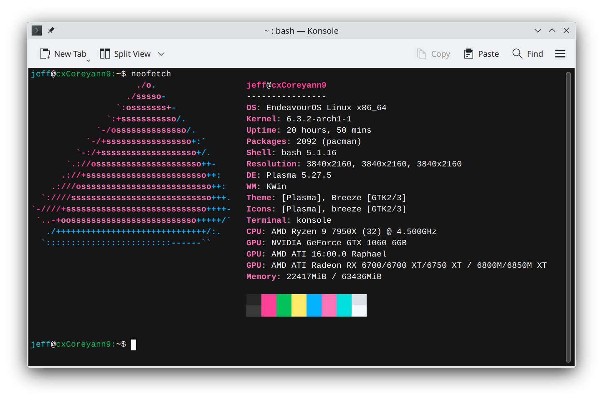

# oxocarbon-konsole

[Oxocarbon](https://github.com/nyoom-engineering/oxocarbon) is a set of community ports of IBM's carbon color palette 
and design philosophy to various applications and tooling. This port is based on 
the [Alacritty color scheme](https://github.com/nyoom-engineering/oxocarbon-alacritty).

## Showcase

## Install

Copy the oxocarbon.colorscheme file to your konsole color schemes directory, usually located at `~/.local/share/konsole/`.

## License

The project is licensed under the MIT license
